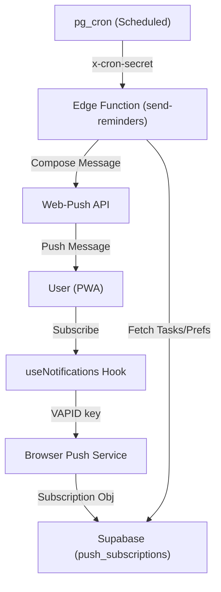

# KōA Notification System Documentation

This document outlines the architecture, logic, and data flow of the notification system in the KōA study tracker.

---

## 🏗️ Architecture Overview

The system uses a **Decoupled PWA Architecture** that bridges the browser's Push API with Supabase Edge Functions.

---

## 📂 Components

### 1. Client-Side: `useNotifications.js`
- **Responsibility**: Permission handling and subscription management.
- **VAPID Keys**: Uses a public VAPID key to identify the application server.
- **Persistence**: Upserts subscription objects (Endpoint, P256dh, Auth) into the `push_subscriptions` table.
- **Status**: Provides `isSubscribed` and `permission` states to the UI.

### 2. Server-Side: `send-reminders` (Edge Function)
- **Trigger**: Invoked periodically (typically every 1 minute) by an external cron or Supabase's `pg_cron`.
- **Security**: Requires an `x-cron-secret` header to prevent unauthorized invocations.
- **Logic Flow**:
  1. Fetches all active `notification_preferences`.
  2. Calculates each user's **local time** using their `tz_offset`.
  3. Checks for three trigger conditions:
     - **Custom Times**: Matches the user's `reminder_times` array.
     - **7 AM Wakeup**: A hardcoded global morning greeting.
     - **8 PM Nudge**: A "Day closer" nudge if tasks are still pending.
  4. **Payload Composition**: Generates dynamic titles and bodies based on the count of `pending` tasks in the `study_plan`.

### 3. Database Schema
- **`public.push_subscriptions`**: Stores unique browser endpoints per user.
- **`public.notification_preferences`**:
  - `enabled`: Global toggle.
  - `reminder_times`: JSON array of time strings (e.g., `["09:00", "15:00"]`).
  - `nudge_8pm_enabled`: Toggle for the late-evening reminder.
  - `tz_offset`: Essential for accurate global delivery.

---

## 💬 Message Catalog

The system dynamically composes messages based on the time of day and the user's progress.

| Trigger | Context | Title | Body Copy |
| :--- | :--- | :--- | :--- |
| **7 AM Wakeup** | Tasks pending | Morning! Rise and Grind ☀️ | You have {N} tasks mapped out today. Let's start strong! |
| **7 AM Wakeup** | No tasks | Morning! Rise and Grind ☀️ | You have a clean slate today! Time to get ahead of the curve. |
| **8 PM Nudge** | Tasks pending | Closing the day? | You have {N} tasks left for today. Finish them now to keep your streak alive! 🔥 |
| **8 PM Nudge** | No tasks | — | (Nudge skipped if day is complete) |
| **Custom Slot** | Tasks pending | Ready to study? | You have {N} tasks for today. Start small, finish big. |
| **Custom Slot** | No tasks | Clean Slate! | No tasks pending for today. Use the extra time to get ahead! |

### 🎭 Tone & Personality
Users can toggle between different "Tones" in their profile settings, which subtly changes the messaging:
- **Motivational (Default)**: Uses encouraging language like "Let's start strong" and "Finish big."
- **Strict**: Swaps titles for "Get to Work." or "Focus Required." and uses more direct calls to action.

---

## ⚡ Interaction & Actions

Notifications include a primary action button:
- **"🚀 Start Session"**: Deep-links the user directly to the **Today View** and triggers the focus timer state.

### Metadata
- **Icon**: `/icon-512.png`
- **Behavior**: `requireInteraction: true` ensures the notification stays on screen until the user acknowledges it (perfect for strict focus).

---

## ⚡ Specialized Logic

### 🚀 Smart Triggers
- **Task Awareness**: Reminders aren't just pings; they contain real-time counts. If a user has completed everything, they get a "Clean Slate" message instead of a nudge.
- **Exam Motivation**: On exam days, the system prioritizes "Best of Luck" messaging over standard reminders.

### 🔒 Security & Reliability
- **VAPID Details**: Signed with a unique private key to ensure browsers trust our push server.
- **Stale Removal**: If a push service returns `404` or `410` (Expired/Unsubscribed), the system automatically purges that record from the database.
- **Secret Management**: Cron secrets are stored in Supabase Secrets for secure Edge Function invocation.

---

## 🛠️ Testing & Debugging
- **Manual Test**: The Profile view contains a "Send Test Notification" button that invokes a specialized `test-push` Edge Function for immediate verification of the PWA channel.
